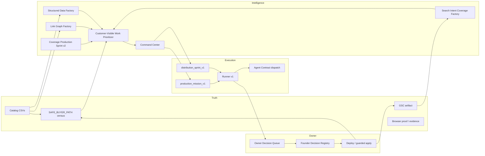

# Foundation v3 — Distribution & Demand Capture (Design)

**Status:** Design only — no implementation authorized by this document.  
**Governing:** `docs/BuckParts-CONSTITUTION.md`, `docs/ARCHITECTURE.md`, `docs/BuckParts-FOUNDATION-V2-COMPLETION.md`  
**Truth contract:** Repo truth over memory. Label claims **PROVEN**, **INFERRED**, or **UNKNOWN**.

**PROVEN:** Foundation v2 delivered a **proven once** end-to-end operating loop (`production_mission_v1`, lifecycle `a6b27301…`, `SAFE_BUYER_PATH_PROVEN` delta +1, census **49**). Foundation v3 must **extend that loop toward customer discovery and completion** — not add a parallel orchestration stack.

---

## 1. Design intent

### 1.1 Problem statement

Foundation v2 proves BuckParts can **produce** trusted buyer paths (evidence → approval → guarded apply → census delta). It does **not** yet prove BuckParts can **continuously convert proven truth into customer-visible discovery, comprehension, and completion**.

**PROVEN gap:** Many distribution-adjacent factories exist as **read-only experiments or partial lanes** (`referenceability_factory_run_v1`, `search_intent_factory_proof_experiment_v1`, `demand_to_coverage_next_lane_v1`, `marketing_intelligence_engine_v1`). They are **not composed** into a repeatable operating loop with measurement tied to `SAFE_BUYER_PATH_PROVEN` growth and organic signals.

### 1.2 Foundation v3 definition

**Foundation v3 — Distribution & Demand Capture** is the smallest set of **reusable read-only factories + one Runner mission composition** that:

1. Turns **proven compatibility and census truth** into **internal link plans** customers can follow.
2. Emits **structured data** only from **repo-proven fields** with existing forbidden-key guards.
3. Maps **search demand and trust questions** to **evidence-backed work items** — never invented FAQ copy.
4. **Prioritizes customer-visible work** from existing Command Center signals — without a new NBA engine.
5. **Measures** whether distribution work correlates with proven-path growth, GSC movement, and completion proxies.

### 1.3 Doctrine (inherits Foundation v2)

| Rule | Source |
|------|--------|
| Extend through **production use**, not new architectural layers | `docs/BuckParts-FOUNDATION-V2-COMPLETION.md` §8 |
| Customer outcomes outrank internal elegance | `docs/BuckParts-CONSTITUTION.md` §3 |
| Demand and clicks do **not** substitute for fit or listing evidence | Constitution §6; `docs/ARCHITECTURE.md` § Truth |
| Runner never mutates CSV/Supabase; public deploys stay founder-gated | `docs/BuckParts-PRODUCTION-MISSION-V1.md`; `docs/ARCHITECTURE.md` § Execution |
| Read-only factories first; mutation only via existing guarded executors + registry | HQ handoff operating model |

### 1.4 What Foundation v3 does **not** build

**PROVEN already in Foundation v2 — do not reinvent:**

| Capability | Existing contract |
|------------|-------------------|
| Mission orchestration | `buckparts_runner_v1` |
| End-to-end production loop | `production_mission_v1` |
| External operator handoff | `agent_contract_v1` |
| Owner approval halts | `owner_decision_queue_v1` |
| Throughput measurement shell | `operations_metrics_v1` |
| Batch ranking for proven delta | `coverage_production_sprint_v2_v1` |
| Command Center steering surface | `command_center_v2` |
| GSC artifact ingestion | `npm run buckparts:gsc:fetch` → `data/reports/buckparts-gsc-search-analytics.json` |
| Demand ↔ coverage join | `demand_to_coverage_next_lane_v1` |
| Marketing opportunity ranking (draft-only) | `marketing_intelligence_engine_v1` |
| Referenceability gap detection (Slice 1) | `referenceability_factory_run_v1` |
| Product JSON-LD helpers (Phase 1) | `src/lib/seo/structured-data.ts` |
| Universal trust questions | `docs/BuckParts-UNIVERSAL-PAGE-TRUST-CONTRACT.md` |
| Page quality gate (incl. internal links) | `buckparts_page_quality_gate_v1` |
| Distribution opportunity **registry** (planning records) | `distribution_opportunity_registry_v1` |

Foundation v3 **composes and hardens** these — it does not replace Runner, Production Mission, or Operations Metrics.

---

## 2. Smallest reusable system set (five factories + one extension)

Foundation v3 introduces **five read-only factory contracts** and **one extension** to existing metrics:

| # | Contract (proposed) | Role |
|---|---------------------|------|
| 1 | `proven_compat_link_graph_v1` | Internal link graph from proven compatibility |
| 2 | `evidence_bound_structured_data_v1` | JSON-LD/spec plans from proven CSV fields only |
| 3 | `search_intent_question_coverage_v1` | Search-intent ↔ page ↔ trust-question work items |
| 4 | `customer_visible_work_prioritizer_v1` | Ranked distribution + coverage queue from CC signals |
| 5 | `distribution_impact_metrics_v1` | Extend `operations_metrics_v1` with discovery/completion KPIs |
| — | `distribution_sprint_v1` (Runner mission) | **Composition only** — reuses Runner + Fv2 stack |

**INFERRED:** Five factories are the minimum distinct contracts; each maps 1:1 to the five design focus areas without overlapping orchestration responsibility.

---

## 3. System specifications

---

### System 1 — Proven Compat Link Graph Factory v1

**Contract (proposed):** `proven_compat_link_graph_v1`

#### Purpose

Generate a **read-only directed link graph** and **per-page internal link plans** using **only** compatibility relationships already committed in CSV and endpoints that exist in the catalog — prioritizing edges where **at least one endpoint** is `SAFE_BUYER_PATH_PROVEN`.

Customer value: homeowners move between **model ↔ filter ↔ help** pages without leaving for forums, reducing wrong-part orders on adjacent decisions.

#### Inputs

| Input | Layer | PROVEN source |
|-------|-------|---------------|
| `compatibility_mappings.csv` (and wedge equivalents) | Truth | `data/compatibility_mappings.csv`, `data/air-purifier/compatibility_mappings.csv`, etc. |
| `filters.csv`, `fridge_models.csv`, aliases | Truth | `data/EXPECTED_HEADERS.txt` |
| `all_product_safe_buyer_path_census_v1` | Truth | `scripts/lib/all-product-safe-buyer-path-census-v1.ts` |
| Public route conventions | Truth | `/filter/[slug]`, `/fridge/[slug]`, wedge segment layouts |
| Existing page quality gate internal link evaluation | Intelligence | `scripts/lib/buckparts-page-quality-gate-v1.ts` — gate `internal_link_context` |
| Referenceability `INTERNAL_LINK_PLAN` findings | Intelligence | `scripts/lib/referenceability-factory-gap-detectors-v1.ts` |
| Marketing intelligence `suggested_internal_links` (secondary) | Intelligence | `scripts/lib/buckparts-marketing-intelligence-engine-v1.ts` |

#### Outputs

| Output | Description |
|--------|-------------|
| `buckparts_proven_compat_link_graph_v1` JSON (stdout or artifact) | Nodes: `{ route, slug, wedge, page_classification }`; edges: `{ from, to, edge_kind, evidence_ref }` where `edge_kind ∈ { filter_to_model, model_to_filter, filter_to_help, help_to_filter }` |
| Per-slug **link plan** rows | Ordered `{ target_route, anchor_text_basis, evidence_paths[], truth_risk }` — **plans only**, no HTML |
| `proven_facts` / `unknown_facts` | Truth contract labels |
| Command Center lane projection (optional v1.1) | `.command_center_v2.proven_compat_link_graph_v1` — **INFERRED** |

**Edge eligibility rule (invariant):** An edge is emitted only if both endpoints resolve to known catalog slugs **and** the mapping row exists in committed CSV. No inferred compat.

#### Invariants

1. **PROVEN:** Read-only — `read_only: true`, `data_mutation: false`, `mutation_authorized: false`.
2. **PROVEN:** No edge without `compatibility_mappings.csv` (or wedge equivalent) row citation.
3. **PROVEN:** Prefer edges touching `SAFE_BUYER_PATH_PROVEN` endpoints; edges between suppressed/unproven endpoints are allowed but ranked lower — **never** presented as “recommended path to buy.”
4. **PROVEN:** Align with page quality gate — do not plan links to slugs missing from `filters.csv` / model registry.
5. **PROVEN:** Constitution §6 — demand impressions do **not** create compat edges.

#### Owner approval requirements

| Action | Approval |
|--------|------------|
| Factory run (read-only) | None |
| Applying link plans to public React templates | **Founder / owner copy review** + normal deploy path |
| Registry CSV changes to create new routes | **Existing** founder-guarded apply executors — **not** this factory |

**INFERRED:** Link plan application is a **Distribution Agent Contract** handoff (reuse `agent_contract_v1` pattern) when changes touch public HTML — same boundaries as browser proof dispatch.

#### Layer integration

| Layer | Role |
|-------|------|
| **Truth** | Reads CSV + census only |
| **Intelligence** | Ranks edges; feeds CC lane and prioritizer |
| **Execution** | Runner step: `tsx_report` calling `scripts/report-proven-compat-link-graph-v1.ts` — **INFERRED path** |
| **Owner** | ODQ entry when deploy classifier flags public template edits |

#### Foundation v2 reuse

- Census classification labels from production mission census step
- Runner mission step pattern from `production_mission_v1`
- Agent Contract for external template edits (if dispatched)
- Operations Metrics — count link-plan work items completed per sprint — **INFERRED**

#### PROVEN vs INFERRED vs UNKNOWN

| Claim | Status |
|-------|--------|
| Compat CSV is source of truth for fridge↔filter links | **PROVEN** (`supabase/schema.sql`, `data/EXPECTED_HEADERS.txt`) |
| Page quality gate validates internal link targets for page factory | **PROVEN** (`buckparts-page-quality-gate-v1.ts`) |
| Referenceability factory emits `INTERNAL_LINK_PLAN` work items from compat count | **PROVEN** (`referenceability-factory-gap-detectors-v1.ts`) |
| Site-wide aggregated link graph factory | **INFERRED** — not yet a single contract |
| Organic discovery lift from internal links | **UNKNOWN** — requires GSC before/after + distribution metrics |

---

### System 2 — Evidence-Bound Structured Data Factory v1

**Contract (proposed):** `evidence_bound_structured_data_v1`

#### Purpose

Produce **structured data specifications** (JSON-LD graphs and future schema types) **only** from fields explicitly present in committed catalog CSVs and existing SEO helpers — with automated rejection of commerce/review keys.

Customer value: search engines and AI systems cite **correct part identity** (MPN, brand) without BuckParts inventing offers, prices, or availability.

#### Inputs

| Input | Layer | PROVEN source |
|-------|-------|---------------|
| `filters.csv` rows (oem, brand, name, description sources) | Truth | CSV + `buildRefrigeratorFilterProductJsonLd` input shape |
| `src/lib/seo/structured-data.ts` | Truth | Existing builders + `FORBIDDEN_JSON_LD_KEYS` |
| Census `SAFE_BUYER_PATH_PROVEN` filter | Truth | Suppress Product schema emission for non-proven slugs — **INFERRED policy** |
| Referenceability structured_data findings | Intelligence | `referenceability-factory-gap-detectors-v1.ts` |
| Live template audit (read-only) | Intelligence | `referenceability-factory-page-packet-v1.ts` — notes JSON-LD on filter template |
| Site URL | Truth | `getRequiredSiteUrl()` |

#### Outputs

| Output | Description |
|--------|-------------|
| Per-route **structured data spec** | `{ route, schema_types[], json_ld_object \| null, missing_proven_fields[], forbidden_key_scan: PASS\|FAIL }` |
| **Wire plan** for gaps | `{ permitted_action_class: STRUCTURED_DATA_WIRE, evidence_paths[], validation_command }` |
| Batch summary | Counts: wired, auditable, blocked (missing OEM/brand/description) |
| CC lane — **INFERRED** | Summaries for prioritizer |

**Null rule:** If required proven fields missing, output `json_ld_object: null` — same as `buildRefrigeratorFilterProductJsonLd` today.

#### Invariants

1. **PROVEN:** Reuse `FORBIDDEN_JSON_LD_KEYS` — no `offers`, `price`, `aggregateRating`, `review`, etc. (`structured-data.ts`).
2. **PROVEN:** No `image` on Product JSON-LD — repo has no proven product image field (`structured-data.ts` comment).
3. **PROVEN:** `truth_closure_claimed: false` on any agent-produced schema patch proposal.
4. **INFERRED:** Emit Product JSON-LD specs **only** for `SAFE_BUYER_PATH_PROVEN` slugs unless founder explicitly approves broader scope.
5. **PROVEN:** Factory is read-only; wiring into `page.tsx` is a separate deploy action.

#### Owner approval requirements

| Action | Approval |
|--------|------------|
| Read-only spec / audit | None |
| Template change to inject JSON-LD | Deploy classifier + founder deploy decision |
| Adding new schema types (FAQ, HowTo) | **Founder approval** — FAQ content must map to Universal Trust Questions with evidence citations |

#### Layer integration

| Layer | Role |
|-------|------|
| **Truth** | CSV fields + SEO helpers |
| **Intelligence** | Gap detection vs referenceability; rank wire plans |
| **Execution** | Runner validation step can run forbidden-key scan + spec diff — **INFERRED** |
| **Owner** | ODQ if deploy touches public templates |

#### Foundation v2 reuse

- SEO Phase 1 foundation (`docs/BuckParts-HQ-HANDOFF.md` — commit `d4bbf0b` cited as PROVEN pushed)
- Referenceability factory Slice 1 (structured_data improvement class)
- Production mission validation phase (lint/build/security gate)
- Agent Contract for Codex/Cursor template wiring tasks

#### PROVEN vs INFERRED vs UNKNOWN

| Claim | Status |
|-------|--------|
| Minimal Product JSON-LD from filter CSV fields | **PROVEN** (`structured-data.ts`, tests in `structured-data.test.ts`) |
| Site-wide Organization + WebSite JSON-LD on root layout | **PROVEN** (HQ handoff SEO Phase 1) |
| Evidence-bound factory contract aggregating all wedges | **INFERRED** |
| FAQ/HowTo schema from trust questions without content invention | **INFERRED** — high truth risk; must reuse search intent work items |
| Rich result eligibility / CTR impact | **UNKNOWN** |

---

### System 3 — Search Intent Question Coverage Factory v1

**Contract (proposed):** `search_intent_question_coverage_v1`

#### Purpose

Connect **GSC query demand**, **on-page trust question coverage** (`docs/BuckParts-UNIVERSAL-PAGE-TRUST-CONTRACT.md`), and **page relationships** into **owner-review work items** — without authoring new compatibility claims or SEO prose in the factory itself.

Customer value: pages answer the questions homeowners actually search, in approved language, on routes where fit is already proven.

#### Inputs

| Input | Layer | PROVEN source |
|-------|-------|---------------|
| GSC artifact | Truth | `data/reports/buckparts-gsc-search-analytics.json`, Supabase durable store |
| `demand_to_coverage_next_lane_v1` top queries/pages | Intelligence | Wedge-level demand join |
| `search_intent_factory_proof_experiment_v1` | Intelligence | Work item classes, rejection reasons, `content_invention_required: false` |
| Census — scope to `SAFE_BUYER_PATH_PROVEN` pages first | Truth | Aligns with proof experiment page selection |
| Universal Trust Questions Q1–Q9 | Truth | `docs/BuckParts-UNIVERSAL-PAGE-TRUST-CONTRACT.md` |
| Proven compat link graph (System 1) | Intelligence | Question “which models?” → linked routes |
| Internal search gaps (optional) | Intelligence | `buckparts_demand_work_queue_v1` — zero-result gaps |

**UNKNOWN blocker:** `scripts/lib/buckparts-search-intent-alignment-experiment-v1.ts` is **imported** by the proof experiment but **not present** in repo at design time — alignment experiment must be restored or inlined before factory promotion.

#### Outputs

| Output | Description |
|--------|-------------|
| `search_intent_question_coverage_v1` report | Per `{ route, slug, wedge }`: `{ alignment_classification, trust_questions_covered[], trust_questions_missing[], matched_gsc_queries[], work_items[] }` |
| Work items | Classes from proof experiment: `SEARCH_LANGUAGE_ALIGNMENT`, `QUERY_ALIAS_REVIEW`, `FAQ_OPPORTUNITY`, `HEADING_ALIGNMENT`, `VOCABULARY_GAP` |
| Rejected items | With `SearchIntentFactoryProofRejectionReasonV1` — e.g. `CONTENT_INVENTION_REQUIRED`, `COMPATIBILITY_CLAIM_REQUIRED` |
| Question coverage score | **INFERRED** — `% of applicable trust questions with evidence-backed on-page anchors` |

#### Invariants

1. **PROVEN:** Hypothesis from proof experiment: factory must **not** invent facts (`SEARCH_INTENT_FACTORY_PROOF_HYPOTHESIS_V1`).
2. **PROVEN:** Reject work items requiring compatibility claims not in CSV/evidence.
3. **PROVEN:** Reject `SEO_COPY_REQUIRED` and `METADATA_EDIT_REQUIRED` without owner review path.
4. **PROVEN:** GSC queries inform **prioritization only** — not fit authority (Constitution §6).
5. **INFERRED:** FAQ opportunities must map 1:1 to Universal Trust Questions with `evidence[]` paths — no free-text answers in factory output.

#### Owner approval requirements

| Action | Approval |
|--------|------------|
| Read-only coverage report | None |
| Copy/metadata edits from work items | **Owner copy review** (Universal Page Trust Contract) |
| New public FAQ sections | Founder taste + phrase guard (`live-site-trust-page-content-contract-v1`) |

#### Layer integration

| Layer | Role |
|-------|------|
| **Truth** | GSC artifact, trust contract, census |
| **Intelligence** | Coverage scoring; feeds prioritizer |
| **Execution** | Agent dispatch for HyperAgent/homeowner-language audit of top pages — reuse `agent_contract_v1` |
| **Owner** | ODQ for public copy changes |

#### Foundation v2 reuse

- Search intent proof experiment (`npm run buckparts:search-intent-factory:proof-experiment`)
- Demand-to-coverage next lane
- Agent Contract + Production Mission dispatch pattern
- Referenceability factory (homeowner_comprehension, human_readability classes)

#### PROVEN vs INFERRED vs UNKNOWN

| Claim | Status |
|-------|--------|
| Proof experiment defines work item taxonomy and rejection rules | **PROVEN** (`buckparts-search-intent-factory-proof-experiment-v1.ts`) |
| GSC ingestion pipeline exists | **PROVEN** (`docs/buckparts-gsc-api-artifact-ingestion.md`, `demand-to-coverage-next-lane-v1.ts`) |
| Universal trust questions are documented | **PROVEN** (`docs/BuckParts-UNIVERSAL-PAGE-TRUST-CONTRACT.md`) |
| Full alignment experiment module on disk | **UNKNOWN** — imported path missing; blocks factory v1 |
| Automated trust-question detection on live HTML | **INFERRED** — may require HyperAgent dispatch, not static analysis alone |

---

### System 4 — Customer-Visible Work Prioritizer v1

**Contract (proposed):** `customer_visible_work_prioritizer_v1`

#### Purpose

Produce a **single ranked queue** of **customer-visible** work — distribution improvements **and** proven-path production — by **composing existing Command Center signals**, without replacing `next_best_action` logic or adding auto-orchestration.

Customer value: operators always work the highest-impact **customer-facing** item next: prove a path, make a proven path discoverable, or answer demand on a proven page.

#### Inputs

| Input | Signal | PROVEN CC lane / factory |
|-------|--------|--------------------------|
| Proven delta opportunity | Coverage production | `coverage_production_sprint_v2_v1` |
| Demand vs coverage gap | External demand | `demand_to_coverage_next_lane_v1` |
| Distribution gaps on proven pages | Referenceability | `referenceability_factory_run_v1` work items |
| Search intent gaps | Query ↔ page | System 3 output |
| Link graph gaps | Internal navigation | System 1 output |
| Structured data gaps | Schema | System 2 output |
| Marketing opportunities (draft-only) | Pain/risk ranking | `marketing_intelligence_engine_v1` — **publishability filter** |
| Demand work queue items | GSC / internal search | `buckparts_demand_work_queue_v1` |
| Production mission lifecycle state | Operating loop | `production_mission_v1` lane |
| Operations metrics trend | Throughput | `operations_metrics_v1` |

#### Outputs

| Output | Description |
|--------|-------------|
| Ranked `customer_visible_work_item_v1[]` | `{ rank, work_kind, slug, route, customer_impact_summary, evidence_paths[], executability, blocked_by[], recommended_command, foundation_v2_mission_hint }` |
| `work_kind` enum (proposed) | `PROVEN_PATH_PRODUCTION`, `INTERNAL_LINK_APPLY`, `STRUCTURED_DATA_WIRE`, `SEARCH_INTENT_ALIGN`, `DEMAND_CAPTURE_REVIEW`, `COPY_TRUST_ALIGN` |
| Steering recommendation | **Read-only** string for CC — does **not** override issue/emergency steering already in `report-buckparts-command-center.ts` |
| Conflict notes | When demand points to unproven slug — item demoted or tagged `NEEDS_COVERAGE_FIRST` |

**Ranking policy (invariant):** For equal demand scores, **`PROVEN_PATH_PRODUCTION` wins over distribution polish** — no SEO work on pages that are not `SAFE_BUYER_PATH_PROVEN` unless explicitly tagged as demand-research-only.

#### Invariants

1. **PROVEN:** Read-only — no auto-run of next script (Architecture § Intelligence — CC is not orchestrator).
2. **PROVEN:** No item with `mutation_authorized: true` in prioritizer output.
3. **PROVEN:** Demand signals **cannot** promote `READY_FOR_APPLY` or compat authority.
4. **INFERRED:** At most one **top** item marked `RECOMMENDED_NOW`; others queued.
5. **PROVEN:** Reuse existing steering override precedence from Command Center — prioritizer is **input** to NBA, not replacement — **INFERRED integration shape**.

#### Owner approval requirements

| Action | Approval |
|--------|------------|
| Running prioritizer | None |
| Executing ranked item | Per item kind — production missions use existing ODQ + registry; copy/deploy uses founder deploy |

#### Layer integration

| Layer | Role |
|-------|------|
| **Truth** | Aggregates read-only reports |
| **Intelligence** | **Primary home** — ranked queue + CC lane |
| **Execution** | Items reference Runner commands (`production_mission_v1`, future `distribution_sprint_v1`) |
| **Owner** | Top item may trigger ODQ when action is deploy or mutation |

#### Foundation v2 reuse

- Entire Foundation v2 stack for `PROVEN_PATH_PRODUCTION` items
- Coverage Production Sprint v2 ranking
- Command Center v2 aggregation pattern (`scripts/report-buckparts-command-center.ts`)
- `distribution_opportunity_registry_v1` for **manual** channel plans — prioritizer may **index** but not auto-create registry rows

#### PROVEN vs INFERRED vs UNKNOWN

| Claim | Status |
|-------|--------|
| Multiple independent steering lanes exist in CC | **PROVEN** |
| Coverage sprint ranks batches by proven delta | **PROVEN** |
| Unified customer-visible prioritizer contract | **INFERRED** |
| Optimal ranking weights | **UNKNOWN** — tune via distribution metrics |

---

### System 5 — Distribution Impact Metrics v1

**Contract (proposed):** `distribution_impact_metrics_v1` — **extends** `operations_metrics_v1`, does not replace it.

#### Purpose

Measure whether Foundation v3 work increases **proven path inventory**, **organic discovery**, and **customer completion proxies** — with explicit **non-claims** when sample size is insufficient.

Customer value: prove the continuous engine is working before adding more systems.

#### Inputs

| Input | Metric use | PROVEN source |
|-------|------------|---------------|
| Census snapshots | `SAFE_BUYER_PATH_PROVEN` count / delta | `all_product_safe_buyer_path_census_v1`, ops metrics history |
| GSC artifact time series | Impressions, clicks, CTR by page/query | GSC artifact + `gsc-external-demand.ts` |
| Production + distribution mission artifacts | Work completed, duration | Runner runs, lifecycle JSON |
| Link graph + structured data specs | Distribution work units applied | Systems 1–2 artifacts — **INFERRED** |
| Search intent work items closed | Question coverage delta | System 3 — **INFERRED** |
| Customer authority / closure signals | Completion proxy | `customer-authority-score-v1.ts`, `customer_visible_closures_count` |
| Internal search analytics | Zero-result rate | Demand work queue inputs — **PARTIAL** |

#### Outputs

| Output | Description |
|--------|-------------|
| `distribution_impact_metrics_v1` report | KPIs + `proven_facts` / `unknown_facts` |
| Append-only history | `data/command-center/distribution-metrics/history-v1.jsonl` — **INFERRED path** |
| CC lane extension | Nested under or sibling to `operations_metrics_v1` |
| Hypothesis blocks | e.g. `{ proven_delta_30d, gsc_clicks_delta_30d, correlation: UNKNOWN }` |

**Proposed KPIs:**

| KPI | Definition | Status |
|-----|------------|--------|
| `safe_buyer_path_proven_delta` | Census diff vs prior snapshot | **PROVEN** (already in ops metrics) |
| `proven_pages_with_link_plan` | % proven slugs with ≥1 compat link plan | **INFERRED** |
| `proven_pages_with_valid_product_json_ld` | Spec PASS vs census proven count | **INFERRED** |
| `trust_question_coverage_avg` | From System 3 | **INFERRED** |
| `gsc_clicks_on_proven_routes` | Sum clicks for routes where census = PROVEN | **INFERRED** |
| `customer_visible_closures_count` | Existing closure proxy | **PROVEN** field exists; **UNKNOWN** causal link |
| `distribution_work_items_completed` | Count from Runner | **INFERRED** |

**Interpretation rule (inherits ops metrics):** Require **≥2 snapshots over real operating time** before claiming throughput or discovery improvement (`docs/BuckParts-OPERATIONS-METRICS-V1.md`).

#### Invariants

1. **PROVEN:** Measurement only — no orchestration (`operations_metrics_v1` doctrine).
2. **PROVEN:** UNKNOWN over guessing — GSC ↔ proven delta correlation is **not** claimed without series.
3. **PROVEN:** Revenue/affiliate conversion **not** in v1 scope — **UNKNOWN** inputs excluded from `buckparts_demand_work_queue_v1` (`PAGE_WITH_CLICKS_NO_REVENUE_UNKNOWN`).

#### Owner approval requirements

None for read-only metrics. Snapshot recording follows ops metrics pattern (`--record-snapshot`).

#### Layer integration

| Layer | Role |
|-------|------|
| **Truth** | Indexes artifacts |
| **Intelligence** | Trend interpretation; feeds prioritizer weight tuning |
| **Execution** | Optional Runner step at end of `distribution_sprint_v1` |
| **Owner** | Founder reviews metrics in dashboard — no mutation |

#### Foundation v2 reuse

- `operations_metrics_v1` history format and snapshot CLI pattern
- Production mission lifecycle metrics append
- GSC fetch + demand-to-coverage plumbing

#### PROVEN vs INFERRED vs UNKNOWN

| Claim | Status |
|-------|--------|
| Ops metrics tracks census delta | **PROVEN** |
| GSC artifact available for demand joins | **PROVEN** |
| Distribution-specific metrics contract | **INFERRED** |
| Organic discovery lift attributable to Foundation v3 | **UNKNOWN** |
| Customer completion measurement end-to-end | **UNKNOWN** — closure count exists; go-link funnel not proven in metrics |

---

## 4. Integration — Distribution Sprint v1 (Runner mission composition)

**Not a new orchestration framework** — a **`buckparts_runner_v1` mission** mirroring `production_mission_v1` step composition.

### Proposed mission: `distribution_sprint_v1`

**Purpose:** Run one prioritized cycle of **customer-visible distribution work** on **proven** inventory, record metrics, halt for owner deploy/copy as needed.

**INFERRED step order:**

```
1. census_baseline                    (reuse existing report)
2. customer_visible_work_prioritizer  (System 4)
3. proven_compat_link_graph           (System 1 — scoped to top N proven slugs)
4. evidence_bound_structured_data     (System 2 — same scope)
5. search_intent_question_coverage    (System 3 — same scope)
6. external_agent_dispatch            (reuse agent_contract_v1 — copy/template tasks only)
7. validation                         (reuse Runner validation phase)
8. owner_decision_queue               (reuse ODQ on deploy/copy halts)
9. distribution_impact_metrics        (System 5 — append snapshot)
10. lifecycle artifact                (mirror production_mission_lifecycle pattern — INFERRED)
```

**Lifecycle complete rule (proposed):** Distribution sprint lifecycle is **complete** when **at least one customer-visible work item** reaches `VALIDATED_COMPLETE` state **and** metrics snapshot recorded — **not** when census delta ≥1 (that remains production mission's job).

**PROVEN pattern to copy:** `production_mission_v1` — dry-run inside Runner; deploy outside Runner.

---

## 5. Continuous customer-value engine (operating loop)



**Operating rhythm (INFERRED):**

1. **Production mission** when prioritizer top item is `PROVEN_PATH_PRODUCTION` (Foundation v2 loop).
2. **Distribution sprint** when top items are link/schema/search alignment on **already proven** slugs.
3. **Metrics snapshot** weekly or after each mission — compare series before expanding scope.
4. **No third mission type** until both loops repeat successfully without composition fixes.

---

## 6. Phased rollout (minimal risk)

| Phase | Deliverable | Success criterion | Status |
|-------|-------------|-------------------|--------|
| **0** | Restore or implement missing search intent alignment module | Proof experiment runs without import gap | **UNKNOWN** — file missing |
| **1** | System 1 + 2 read-only factories on refrigerator_water proven cohort | JSON stdout; zero mutation; aligns with referenceability findings | **INFERRED** |
| **2** | System 3 on proven cohort + GSC | Work items; rejection rate documented | **INFERRED** |
| **3** | System 4 prioritizer CC lane | Single ranked queue; manual operator validation | **INFERRED** |
| **4** | System 5 metrics extension | History JSONL; 2+ snapshots | **INFERRED** |
| **5** | `distribution_sprint_v1` Runner mission | One end-to-end dry-run with ODQ halt on deploy | **INFERRED** |
| **6** | Repeat production + distribution alternation | Census delta + GSC movement on proven routes — correlation still **UNKNOWN** until series exists | **INFERRED** |

---

## 7. Explicit non-goals (Foundation v3)

- New vendor API orchestration layer
- Auto-publish marketing campaigns (`marketing_intelligence_engine_v1` stays draft-only)
- SEO content generation without owner review
- Compatibility inference from search queries
- Replacing Founder Decision Registry or guarded apply executors
- Command Center auto-executing next script
- New wedge expansion logic (reuse Coverage Sprint v2 + production mission)

---

## 8. Summary table — PROVEN / INFERRED / UNKNOWN

| Area | PROVEN | INFERRED | UNKNOWN |
|------|--------|----------|---------|
| **Internal link graph** | Compat CSV; page quality gate; referenceability INTERNAL_LINK_PLAN | Aggregated graph factory | Organic lift |
| **Structured data** | Product JSON-LD helper; forbidden keys; SEO Phase 1 | Factory contract; proven-only emission policy | Rich results / CTR |
| **Search intent coverage** | Proof experiment taxonomy; GSC ingest; trust contract | Full factory; question coverage score | Alignment module on disk; automated HTML Q detection |
| **Prioritization** | CC lanes; coverage sprint; demand-to-coverage | Unified prioritizer | Optimal weights |
| **Measurement** | Census delta in ops metrics; GSC artifact; closure count field | Distribution metrics extension | Causality; completion funnel |
| **Integration** | Runner + production mission pattern | distribution_sprint_v1 | Repeated distribution lifecycle proof |

---

## 9. Repo-truth citations

| Document / module | Use in this design |
|-------------------|-------------------|
| `docs/BuckParts-FOUNDATION-V2-COMPLETION.md` | v2 proof state, doctrine |
| `docs/ARCHITECTURE.md` | Four layers, invariants, deferred scope |
| `docs/BuckParts-PRODUCTION-MISSION-V1.md` | Mission composition pattern |
| `docs/BuckParts-OPERATIONS-METRICS-V1.md` | Measurement doctrine |
| `docs/BuckParts-AGENT-CONTRACT-V1.md` | External operator boundaries |
| `docs/BuckParts-UNIVERSAL-PAGE-TRUST-CONTRACT.md` | Trust questions for search intent |
| `docs/BuckParts-CONSTITUTION.md` | Customer value over traffic |
| `src/lib/seo/structured-data.ts` | JSON-LD bounds |
| `scripts/lib/referenceability-factory-run-v1.ts` | Distribution gap Slice 1 |
| `scripts/lib/referenceability-factory-gap-detectors-v1.ts` | Link/schema/trust work classes |
| `scripts/lib/demand-to-coverage-next-lane-v1.ts` | Demand ↔ coverage |
| `scripts/lib/buckparts-marketing-intelligence-engine-v1.ts` | Opportunity ranking (draft) |
| `scripts/lib/buckparts-search-intent-factory-proof-experiment-v1.ts` | Search intent factory hypothesis |
| `scripts/lib/coverage-production-sprint-v2.ts` | Proven delta batch ranking |
| `scripts/lib/buckparts-page-quality-gate-v1.ts` | Internal link context gate |
| `scripts/report-buckparts-demand-work-queue.ts` | Demand capture queue |
| `scripts/lib/command-center-distribution-opportunity-registry-v1.ts` | Manual distribution registry |

---

## 10. Design metadata

| Field | Value |
|-------|-------|
| **Document type** | Design only — no code |
| **Deploy impact** | `NO_DEPLOY_NEEDED` |
| **SAFE_TO_COMMIT** | **SAFE_TO_COMMIT** — docs-only |
| **Next action (operational)** | Phase 0 — resolve search intent alignment module gap; run referenceability + proof experiment on proven cohort; draft prioritizer ranking manually before automation |
