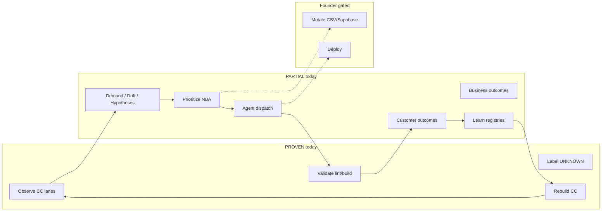

# Command Center Control Loop v1 Audit

**Read-only audit · repo truth only · no Supabase/CSV writes**

| Field | Value |
|-------|-------|
| Generated | 2026-06-23T04:05:47.000Z |
| Git HEAD | `2b7febe` — *Surface Truth Integrity Registry in Command Center* |
| Machine artifact | `data/control-plane/command-center-control-loop-v1.audit.json` |

## Purpose

Measure how close BuckParts is to the **automated operating loop** the Command Center is meant to drive — without inventing capabilities that are not in the repo.

Target loop:

```
Observe reality → Detect demand → Detect drift → Detect uncertainty
→ Generate hypotheses → Prioritize opportunities → Assign investigation
→ Collect evidence → Challenge evidence → Measure confidence → Decide
→ Generate work → Assign agent → Agent executes → Validate output
→ Measure customer outcome → Measure business outcome → Learn
→ Update Command Center → Repeat
```

## Executive summary

| Classification | Count |
|----------------|-------|
| PROVEN | 4 |
| PARTIAL | 16 |
| UNKNOWN | 0 |
| MISSING | 0 |

**Overall distance to full loop: PARTIAL.**

The repo has a strong **observe → aggregate → report** backbone (`buckparts_command_center_v1` / `command_center_v2`). Uncertainty is labeled honestly. Build validation is real. Customer-outcome and learn lanes exist but need history cadence. The weak half is **closed-loop repeat**: agent execution, business-outcome measurement, learn→steer feedback, and external signals (Sentry, revenue) are not wired into a single autonomous cycle.

---

## Loop step matrix

| Step | Status | Primary support |
|------|--------|-----------------|
| Observe reality | **PROVEN** | `npm run buckparts:command-center`, `npm run buckparts:daily`, neurons, deploy monitor, live-site smoke |
| Detect demand | **PARTIAL** | GSC external demand, `search_and_click_intelligence_summary`, demand-to-coverage lane; revenue often NOT_CONNECTED |
| Detect drift | **PARTIAL** | `owner_drift_detector_v1`, `truth_integrity_registry_v1`, AP convergence/diff audits; HQ handoff freshness gap (TIR-0002) |
| Detect uncertainty | **PROVEN** | UNKNOWN / NOT_PROVEN / BLOCKED enums across CC lanes |
| Generate hypotheses | **PARTIAL** | Marketing intelligence, opportunity registries, AP model-first queue, HyperAgent work queue |
| Prioritize opportunities | **PARTIAL** | `next_best_action`, issue registry TIER_0 override, evidence leverage; fragmented prioritizers |
| Assign investigation | **PARTIAL** | Agent control plane jobs, HyperAgent orchestrator v0, CC dispatch runner (manual trigger) |
| Collect evidence | **PROVEN** | Model-first results, `data/evidence/`, browser truth, codex readonly smoke |
| Challenge evidence | **PARTIAL** | Codex output review, cursor_validation overlays, Truth Integrity Registry; not systematic |
| Measure confidence | **PARTIAL** | Per-lane `proof_status`, browser truth, codex task outcomes; no unified gate scalar |
| Decide | **PARTIAL** | Issue registry steering, founder decision registry, mutation authorization review (founder-gated) |
| Generate work | **PARTIAL** | Founder execution packets, agent jobs, batch dispatch, hyperagent packets |
| Assign agent | **PARTIAL** | Permission levels in agent control plane; dispatch scripts require human invocation |
| Agent executes | **PARTIAL** | Codex smoke, HyperAgent dispatch; runner Layer 6 autonomy NOT_PROVEN |
| Validate output | **PROVEN** | `buckparts:runner-step`, operator-proof, lint/build CI |
| Measure customer outcome | **PARTIAL** | `customer_reality_scoreboard_v1`, closure report, authority outcomes (needs snapshot history) |
| Measure business outcome | **PARTIAL** | Revenue snapshot, GA4 trust funnel; frequently NOT_CONNECTED |
| Learn | **PARTIAL** | Learning outcomes insert plan (owner review), failure pattern registry (digest-only) |
| Update Command Center | **PROVEN** | CC rebuilds all lanes each run; truth integrity lane @ `2b7febe` |
| Repeat | **PARTIAL** | Daily operator + founder digest crons; no autonomous observe→execute→learn chain |

Full file/command lists per step: see JSON artifact `loop_steps[]`.

---

## Weakest links (ranked)

1. **Repeat** — Cron runs reports but does not close the loop without founder/Cursor gates. `semi_cruise_status_summary_v1` is observational only.

2. **Agent executes → validate → update CC** — Runner validates lint/build/operator-proof only. Agent dispatch is manual; outcomes do not auto-feed steering gates.

3. **Measure business outcome** — `revenue_snapshot.click_visibility` and GA4 paths are often NOT_CONNECTED; ROI of `next_best_action` is not measurable in-loop.

4. **Learn → update CC steering** — `learning_outcomes_insert_plan_v1` and failure pattern registry are not consumed by gates. Truth integrity does not override `next_best_action` (`steering_override_active: false`).

5. **Detect drift (truth freshness)** — TIR-2026-0001 (shadowed stale browser truth), TIR-2026-0002 (HQ handoff presence vs freshness). Known gaps, not enforced.

6. **Sentry → Command Center** — App has `@sentry/nextjs`; CC lane marks `sentry_errors_feed_command_center: NOT_PROVEN`.

7. **Prioritize opportunities** — Competing surfaces: root NBA, control graph rollup, marketing, AP batch, truth integrity recommended action.

8. **Were we right?** — `customer_authority_outcomes_v1` needs 7-day history snapshots; without cadence, verdicts stay INCONCLUSIVE.

---

## Automation safety

### Safe for agent automation now

| Steps | Permission | Rationale |
|-------|------------|-----------|
| Observe reality, detect uncertainty | `OBSERVE_READ_ONLY` | CC reports, audits, truth integrity counts, readonly smoke |
| Collect evidence | `EVIDENCE_ARTIFACT_WRITE` | Model-first JSON under `data/` with explicit forbidden mutations |
| Validate output | `OBSERVE_READ_ONLY` | lint, build, operator-proof |
| Generate hypotheses / work | `PLAN_ARTIFACT_WRITE` | Queues, packets, planning artifacts |

Evidence: `scripts/lib/buckparts-agent-control-plane-v1.ts`

### Must remain founder / Cursor gated

| Steps | Gate | Rationale |
|-------|------|-----------|
| Decide, assign agent, agent executes | `SAFE_APPLY_GATED`, `DEPLOY_GATED`, `OWNER_ONLY` | Mutation review, Supabase/CSV apply, deploy |
| Learn | `OWNER_ONLY` | Learning outcomes insert plan requires owner review |
| Repeat (scheduled) | Founder cron | Daily operator/digest observe only — no mutation authorization |
| Prioritize opportunities | Founder steering | `next_best_action` affects entire graph; truth integrity override off |

---

## Six operator questions (repo truth)

### 1. What is happening?

**Surfaces:** `operator_digest_v1`, daily operator `runtime_status`, `semi_cruise_status_summary_v1`, `top_of_game_foundation_scorecard_v1`.

**Commands:** `npm run buckparts:command-center`, `npm run buckparts:daily`

**Gaps:** GA4/revenue often NOT_CONNECTED; Sentry not in CC; truth integrity not in brain manifest or founder digest.

### 2. What is broken?

**Surfaces:** `command_center_issue_registry_v1`, `blocked_link_summary`, `truth_integrity_registry_v1`, brain coverage manifest STOP_THE_LINE.

**Commands:** `npm run buckparts:command-center`

**Gaps:** High-severity truth integrity findings do not steer NBA; failure pattern registry is informational only.

### 3. What is uncertain?

**Surfaces:** Browser truth lanes, blocked link summary, `external_quality_signal_usefulness_v1`, customer authority outcomes `INSUFFICIENT_HISTORY`.

**Commands:** `npm run buckparts:command-center`

**Gaps:** No single uncertainty rollup on operator digest root.

### 4. What matters most?

**Surfaces:** `report.next_best_action`, issue registry `steering_override_active`, `evidence_leverage_prioritization_v1`.

**Commands:** `npm run buckparts:command-center`

**Gaps:** Competing prioritizers; truth integrity recommended action not merged into root NBA.

### 5. What should happen next?

**Surfaces:** `next_best_action`, `recommended_truth_integrity_next_action`, `agent_control_plane_v1.jobs`, HyperAgent work queue, batch operating dispatch.

**Commands:** `npm run buckparts:command-center`, `npx tsx scripts/report-hyperagent-work-queue-v1.ts`

**Gaps:** No canonical ranked action list; CC dispatch runner allowlist is narrow.

### 6. Were we right?

**Surfaces:** `customer_authority_outcomes_v1`, `customer_reality_scoreboard_v1`, customer closure report, learning outcomes insert plan.

**Commands:** `npm run buckparts:command-center`, `npx tsx scripts/report-customer-authority-history-v1.ts`

**Gaps:** Snapshot cadence required; business outcomes not tied to prior NBA predictions.

---

## Registry and lane inventory

| Registry / lane | In CC? | Steers NBA? | Key path |
|-----------------|--------|-------------|----------|
| Truth Integrity Registry v1 | Yes (`truth_integrity_registry_v1`) | No | `data/truth-integrity/truth-integrity-registry-v1.json` |
| Issue Registry v1 | Yes | Yes (TIER_0) | `scripts/lib/command-center-issue-registry-v1.ts` |
| Failure Pattern Registry v1 | Digest / dashboard only | No | `src/lib/owner-dashboard/failure-pattern-registry-v1.ts` |
| AP model-first evidence queue | Via batch lanes | No | `scripts/lib/ap-model-first-evidence-queue-v1.ts` |
| AP convergence / diff audits | Artifacts | No | `data/air-purifier/batch-production/audits/` |

### Sentry

- **App wiring:** PROVEN (`sentry.server.config.ts`, `instrumentation.ts`)
- **CC feed:** NOT_PROVEN (`external_quality_signal_usefulness_v1.sentry_errors_feed_command_center`)

### Validation entry points

```bash
npm run buckparts:runner-step
npm run buckparts:operator-proof
npm run buckparts:command-center
npm test -- scripts/lib/command-center-truth-integrity-registry-v1.test.ts
npm run buckparts:stale-browser-truth-shadow
```

CI: `.github/workflows/buckparts-daily-operator.yml`, `buckparts-founder-digest.yml`, `buckparts-runner-step.yml`

---

## Smallest durable v1 recommendation

**Do not add another standalone brain.** Add one read-only projection inside existing Command Center:

### `command_center_control_loop_summary_v1`

A lane that **composes** existing lanes into the six operator questions and loop-step statuses. No new data sources.

| Order | Change | Steering impact |
|-------|--------|-----------------|
| 1 | Add `command_center_control_loop_summary_v1` to CC v2 types + builder | None (read-only) |
| 2 | Extend `operator_digest_v1` with 3–5 line control-loop excerpt | None |
| 3 | Register `truth_integrity_registry_v1` in brain coverage manifest | Visibility only |
| 4 | Optional: daily-operator cron writes customer authority history snapshots to `data/customer-authority-history/` | Enables “were we right?” — file only, no Supabase |

### Explicitly defer

- Truth integrity `steering_override_active` until fixes are measured
- Sentry → CC until durable artifact contract exists
- Layer 6 runner agent execution until operator-proof expands
- Unified opportunity ranker across all batch subgraphs

---

## Architecture sketch (current vs target)



**Proven backbone:** Observe → uncertainty labels → validate build → rebuild CC.

**Missing backbone:** Autonomous repeat, business outcome closure, learn→steer feedback, Sentry ingest, agent execute without founder gate.

---

## Related docs

- `docs/BuckParts-TRUTH-INTEGRITY-REGISTRY.md`
- `docs/BuckParts-FAILURE-PATTERN-REGISTRY.md`
- `data/control-plane/command-center-control-loop-v1.audit.json`
