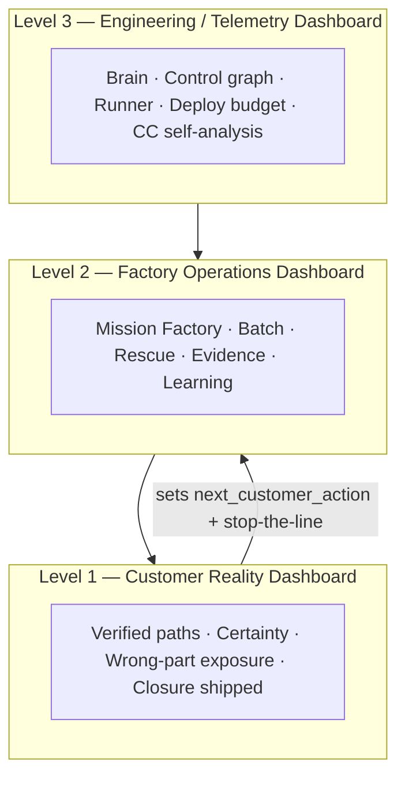
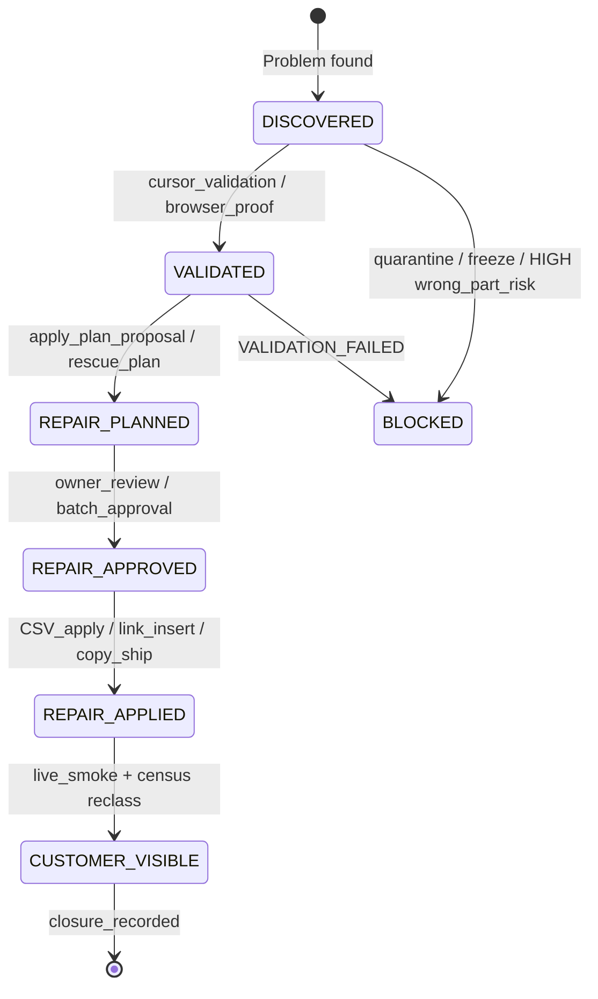

# BuckParts Command Center — Customer Reality Architecture (V1)

**Status:** Architecture spec only — not implemented  
**Version:** `customer_reality_architecture_v1`  
**Date:** 2026-06-10  
**Source:** Customer-Outcome Command Center Audit + Command Center Architecture Reset (read-only)  
**Constraints honored:** No runtime code, no UI, no scoring implementation, no mutation path changes, no weakening of truth gates

**Evidence convention (throughout this doc):**

- **PROVEN:** Directly supported by repo lanes, live Command Center output, or audit artifacts reviewed 2026-06-10.
- **INFERRED:** Reasonable conclusion from repo evidence; not yet a dedicated metric or lane.
- **UNKNOWN:** Not measured in-repo today.

---

## 1. Executive thesis

### Command Center stays

**PROVEN:** BuckParts operates a read-only Command Center (`buckparts_command_center_v1`) that aggregates 70+ v2 lanes from scripts, Supabase reads, and local artifacts. CLI entry: `npm run buckparts:command-center`. Private UI: `/ownerdashboard/[secret]`.

The Command Center is the correct operating system for BuckParts. It already contains the instrumentation needed to steer wrong-part prevention, verified buying paths, search reliability, trust compliance, and repair throughput.

### The scoreboard changes

**PROVEN mismatch (2026-06-10 live snapshot):**

| Signal | Value | Category |
|--------|-------|----------|
| `top_of_game_foundation_scorecard_v1.foundation_maturity_score_100` | **100 / 100** | Engineering Telemetry |
| `buckparts_certainty_engine_checklist_v1.verified_link_coverage` (refrigerator) | **13 / 57 (22.8%)** | Customer Reality |
| `all_product_safe_buyer_path_census_v1.classification_counts` | **23 safe / 91 suppressed / 62 noindex** | Customer Reality |
| `revenue_truth_ledger_contract_v1.valid_entry_count` | **0** | Customer Reality |
| `mission_factory_registry_v1` | **14 dispatch-ready, 1 discovery-complete, 0 promoted** | Factory Reality |

BuckParts is measuring **system construction** better than **customer outcomes**. Internal lanes report PROVEN while homeowners still see suppress-buy on most live product pages.

### Customer reality becomes the root node

**Core principle:**

1. **Customer Reality** sets NBA and stop-the-line priority.
2. **Factory Reality** creates customer outcomes (discovery, validation, repair, coverage).
3. **Engineering Telemetry** supports both but does **not** drive executive priority.



**Winning definition:** Customer Reality metrics improve week-over-week. Factory and Engineering metrics are subordinate servants with explicit closure proof.

**Related doctrine:** `docs/BuckParts-CUSTOMER-UX-DOCTRINE.md`, `docs/BuckParts-CUSTOMER-LANGUAGE-AND-DEFINITIONS.md`, `docs/marketing/BuckParts-Fit-Lookup-Positioning-Idea.md`

---

## 2. Three-layer architecture

### Level 1 — Customer Reality Dashboard

**Audience:** Founder, investors, growth — *"Are homeowners better off today?"*  
**Default view.** All other levels collapsed or linked.

| Panel | Primary lanes | Purpose |
|-------|---------------|---------|
| Customer Scoreboard | *Future composite: Customer Maturity Score* | Single primary health signal |
| Stop-the-line (trust) | `buckparts_certainty_engine_checklist_v1`, `owner_quarantined_fridge_models_v1`, `marketing_intelligence_engine_v1` | Block work when wrong-part risk is exposed |
| Verified Buyer Paths | `all_product_safe_buyer_path_census_v1`, `buckparts_certainty_engine_checklist_v1.verified_link_coverage` | Safe buy vs suppress vs noindex |
| Certainty Visibility | `buckparts_certainty_engine_checklist_v1`, `page_publishability_truth_summary_v1` | Checklist pass rate; PageState / PublishabilityState |
| Search & Journey | `search_and_click_intelligence_summary`, `money_funnel_summary`, neurons `trust_funnel_measurement`, `search_demand_and_gaps` | Search failures, funnel stages |
| Wrong-Part Exposure | `marketing_intelligence_engine_v1`, census `SAFE_BUYER_PATH_SUPPRESSED_TRUST` | HIGH-risk indexable pages |
| Repair Closure Shipped | *Future closure rollup* (§7) | Customer-visible fixes this week |
| Revenue / Commission Truth | `revenue_truth_ledger_contract_v1`, `revenue_snapshot` | Clicks vs commission proof |
| Trust Compliance | `public_trust_unification_backend_contract_v1`, `deploy_live_site_monitor_v1` | Trust modules + live route health |
| High-Demand / No-Buy Emergency | `rpwfe_*` lanes, certainty checklist `high_demand_no_buy_emergency_lane` | Demand present + suppress_buy without plain-language reason |

**NBA lives here:** future field `next_customer_action` (§6).

### Level 2 — Factory Operations Dashboard

**Audience:** Operator, agents, batch owner — *"What work ships customer improvements?"*

| Panel | Primary lanes |
|-------|---------------|
| Rescue Queue | `all_product_safe_buyer_path_census_v1.top_20_rescue_queue`, `amazon_rescue`, `blocked_link_summary` |
| Mission Factory | `mission_factory_registry_v1`, `mission_factory_orchestrator_v1` |
| Batch Production | `batch_production_*`, `fridge_buyer_path_*`, `universal_batch_lifecycle_*` |
| Evidence Pipeline | `recent_evidence`, `evidence_to_learning_*`, `learning_outcomes_*` |
| Coverage Expansion | `air_purifier_batch_coverage_director_v1`, `whole_house_water_*`, `fridge_truth_spine_v1`, `air_purifier_truth_spine_v1`, `wedge_truth_spine_coverage_matrix_v1` |
| Affiliate Factory | `affiliate_readiness`, `affiliate_readiness_summary`, `top_money_queue` |
| Demand Factory | `demand_to_coverage_engine_v1`, `demand_work_queue_summary_v1`, `demand_to_coverage_next_lane_v1` |
| Token / SKU Rescue | `rpwfe_*` (planning detail), `refrigerator_model_first_*`, `ap_model_first_evidence_queue_v1` |
| Marketing Factory | `marketing_intelligence_engine_v1` (full opportunity table) |
| Agent Work Queue | `agent_control_plane_v1`, `next_allowed_agent_token` |

**Factory KPI:** repair closure rate and customer-visible shipments — not dispatch-ready mission count alone.

### Level 3 — Engineering / Telemetry Dashboard

**Audience:** Engineering, CC maintenance — *"Is the brain healthy?"*

| Panel | Primary lanes |
|-------|---------------|
| Brain Integrity | `command_center_brain_coverage_manifest_v1`, `brain_integrity_gate_v1`, `brain_consolidation_plan_v1` |
| Control Graph | `command_center_control_graph_rollup_v1` |
| CC Self-Analysis | `command_center_efficiency_truth_table_v1` |
| Foundation Wiring | `top_of_game_foundation_scorecard_v1` (**demoted here**) |
| Deploy & Budget | `deploy_publish_queue_v1`, `semi_cruise_status_summary_v1` |
| Drift & Compression | `owner_drift_detector_v1`, `operator_process_compression_v1` |
| External Signals | `external_quality_signal_usefulness_v1`, `external_measurement_freshness_v1` |
| Runner / Layer 6 / Codex | Owner Dashboard sections: Layer 6 Readiness, Codex Packet Proof, Codex Output Review, Runner Step Visibility |
| System Health | `system_health_summary`, `owner_integrity_sentinel_v1` |
| Operating Map | `operating_map_summary_v1`, `system_contract_audit_summary_v1`, `founder_decision_registry_summary_v1` |

**Rule:** Level 3 never sets executive NBA. It may block factory work via `brain_integrity_gate_v1` when data integrity would corrupt customer truth.

### Current vs future dashboard order

**PROVEN today** (`src/app/ownerdashboard/[secret]/page.tsx`): Stop-the-line → Founder Control Plane → Batch Production → Agent Control Plane → … → Top-of-Game Foundation (100/100) → Demand → drilldown lanes.

**Future default:** Level 1 Customer Reality panels first; Level 2 and Level 3 behind explicit navigation.

---

## 3. Lane taxonomy

Every major lane belongs to **exactly one** category.

| Category | Definition |
|----------|------------|
| **Customer Reality** | What homeowners experience, or a direct measure of that experience |
| **Factory Reality** | Systems that discover, validate, repair, and ship customer outcomes |
| **Engineering Telemetry** | Infrastructure, meta-analysis, and operator machinery |

### 3.1 V1 root digest (`buckparts_command_center_v1`)

| Field | Category |
|-------|----------|
| `blocked_link_summary` | Customer Reality |
| `search_and_click_intelligence_summary` | Customer Reality |
| `money_funnel_summary` | Customer Reality |
| `rescue_velocity_summary` | Customer Reality |
| `rescue_delta_trend_summary` | Customer Reality |
| `affiliate_readiness_summary` | Factory Reality |
| `top_money_queue` | Factory Reality |
| `recent_learning_outcomes` | Factory Reality |
| `amazon_first_blocked_queue_summary` | Factory Reality |
| `system_health_summary` | Engineering Telemetry |
| `execution_guidance` | Engineering Telemetry |
| `operator_can_be_away_status` | Engineering Telemetry |
| `known_unknowns` | Engineering Telemetry |
| `next_best_action` / `why_this_action` | *Steering (factory-biased today; superseded by `next_customer_action`)* |

### 3.2 V2 lanes — Customer Reality

| Lane | Customer signal |
|------|-----------------|
| `buckparts_certainty_engine_checklist_v1` | Wrong-part-prevention north star (37 checklist items) |
| `all_product_safe_buyer_path_census_v1` | Per-page safe buy / suppress / noindex |
| `page_publishability_truth_summary_v1` | PageState, PublishabilityState, CTA truth |
| `coverage_health` | Safe CTA availability |
| `public_trust_unification_backend_contract_v1` | Trust module compliance on public routes |
| `customer_language_and_waterdrop_research_lane_v1` | Homeowner language standard |
| `marketing_intelligence_engine_v1` | Wrong-part-risk-ranked customer pain map |
| `unknown_or_human_review` | Honest deferral when certainty insufficient |
| `owner_quarantined_fridge_models_v1` | Models withheld from bad public mappings |
| `owner_vertical_launch_policy_v1` | Live vs noindex wedge policy |
| `owner_integrity_sentinel_v1` | Prevents overstated customer claims |
| `sitemap_indexability_audit_v1` | Indexable inventory truth |
| `deploy_live_site_monitor_v1` | Live route HTTP + trust content contract |
| `deploy_live_site_status` | Same (v1 digest form) |
| `revenue_snapshot` | Click visibility (buy intent proxy) |
| `revenue_truth_ledger_contract_v1` | Commission truth |
| `demand_to_coverage_engine_v1` | Search gap backlog |
| `demand_to_coverage_next_lane_v1` | GSC demand × coverage join |
| `rpwfe_purchase_option_rescue_owner_review_v1` | RPWFE customer-visible buy state |
| `rpwfe_verified_link_rescue_plan_v1` | RPWFE verified-link rescue target |
| `rpwfe_official_ge_browser_evidence_review_v1` | RPWFE evidence for labeling |
| `rpwfe_official_ge_apply_plan_proposal_v1` | RPWFE repair plan |
| `rpwfe_official_ge_supabase_parity_plan_v1` | RPWFE live parity check |

### 3.3 V2 lanes — Factory Reality

| Lane | Factory function |
|------|------------------|
| `mission_factory_registry_v1` | Discovery lifecycle registry |
| `mission_factory_orchestrator_v1` | Dispatch preview |
| `agent_control_plane_v1` | Always-on agent work queue |
| `amazon_rescue` | Amazon PDP verification + slot rescue |
| `affiliate_readiness` | Program approval pipeline |
| `recent_evidence` | Evidence file inventory |
| `evidence_to_learning_outcomes_candidate_import_v1` | Evidence → learning_outcomes mapping |
| `learning_outcomes_read_model_v1` | Durable learning memory |
| `learning_outcomes_insert_plan_v1` | Insert ordering plan |
| `learning_outcomes_writer_ready_batch_review_v1` | Writer-ready payloads |
| `learning_outcomes_owner_confidence_assignment_plan_v1` | Confidence assignment gaps |
| `learning_outcomes_confidence_approval_registry_v1` | Owner confidence registry |
| `batch_production_owner_decisions_lane_v1` | Layer 7 founder approvals |
| `batch_production_operating_checklist_v1` | Stage gates + setback detectors |
| `batch_production_operating_dispatch_v1` | Machine-readable batch dispatch |
| `fridge_buyer_path_owner_review_bridge_v1` | Owner-review bridge |
| `fridge_buyer_path_owner_review_packet_v1` | Normalized review packet |
| `fridge_buyer_path_batch_proposal_v1` | Batch proposal |
| `fridge_buyer_path_batch_approval_v1` | Batch approval |
| `fridge_buyer_path_batch_apply_plan_proposal_v1` | Apply-plan proposal |
| `fridge_buyer_path_batch_apply_plan_approval_v1` | Apply-plan approval |
| `batch_run_registry_intake_v1` | Run-registry intake |
| `fridge_guarded_batch_closeout_learning_v1` | Closeout learning packets |
| `fridge_guarded_batch_lifecycle_rule_proposal_v1` | Lifecycle rule proposals |
| `fridge_guarded_batch_lifecycle_rule_promotion_plan_v1` | Rule promotion plan |
| `universal_batch_lifecycle_truth_table_v1` | Universal batch blueprint |
| `universal_batch_lifecycle_apply_readiness_v1` | Apply-readiness discovery |
| `universal_batch_lifecycle_apply_execution_plan_v1` | Apply execution preview |
| `universal_batch_lifecycle_mutation_authorization_review_v1` | Mutation auth review |
| `fridge_truth_spine_v1` | Fridge compatibility truth production |
| `air_purifier_truth_spine_v1` | AP truth production |
| `wedge_truth_spine_coverage_matrix_v1` | Cross-wedge truth parity |
| `refrigerator_model_first_batch_resolver_v1` | Model-first batch resolution |
| `refrigerator_model_first_qa_approval_packet_v1` | Wrong-purchase-prevention QA |
| `air_purifier_batch_coverage_director_v1` | AP coverage expansion |
| `air_purifier_demand_selected_batch_owner_review_v1` | AP demand-selected batch review |
| `air_purifier_model_first_production_lane_v1` | AP model-first strategy |
| `air_purifier_weak_buyer_path_audit_v1` | AP weak path diagnosis |
| `ap_model_first_evidence_queue_v1` | AP evidence queue |
| `ap_batch_v3_run_instantiation_v1` | AP batch v3 descriptor |
| `whole_house_water_batch_production_director_v1` | WHW batch director |
| `whole_house_water_director_model_first_batch_v1` | WHW model-first batch |
| `vacuum_bags_wedge_feasibility_v1` | Pre-launch wedge feasibility |
| `vacuum_bags_research_seed_packet_v1` | Research seed |
| `vacuum_bags_oem_research_evidence_packet_v1` | OEM evidence structure |
| `demand_work_queue_summary_v1` | Demand work queue |
| `large_batch_coverage_factory_summary_v1` | Large batch factory projection |
| `daily_operator_summary_v1` | Daily operator digest |
| `operator_digest_v1` | Root operator guidance mirror |
| `founder_decision_registry_summary_v1` | Founder decision registry |
| `next_execution_packet_summary_v1` | Execution packet summary |
| `operating_map_summary_v1` | Operating topology |
| `system_contract_audit_summary_v1` | System contract audit |
| `external_measurement_freshness_v1` | GSC/GA4 artifact freshness |
| `recommendation_authority` | BRIGHT / SCOPED_PARTIAL / DARK actions |
| `next_allowed_agent_token` | Autonomous token allowance |
| `next_owner_action` | Synthesized owner step |

### 3.4 V2 lanes — Engineering Telemetry

| Lane | Telemetry function |
|------|-------------------|
| `top_of_game_foundation_scorecard_v1` | Internal wiring maturity |
| `command_center_brain_coverage_manifest_v1` | Brain wiring manifest |
| `brain_integrity_gate_v1` | Stop-the-line brain gate |
| `brain_consolidation_plan_v1` | Brain consolidation plan |
| `command_center_efficiency_truth_table_v1` | CC lane duplication diagnostic |
| `command_center_control_graph_rollup_v1` | Control-plane rollup |
| `owner_drift_detector_v1` | New-idea hijack detector |
| `operator_process_compression_v1` | Ship-guard / process compression |
| `external_quality_signal_usefulness_v1` | GitHub/Sentry usefulness audit |
| `semi_cruise_status_summary_v1` | Netlify credit conservation |
| `deploy_publish_queue_v1` | Publish budget gate |

### 3.5 Owner Dashboard neurons (`owner_command_center_neurons`)

| Neuron | Category |
|--------|----------|
| `page_state_distribution` | Customer Reality |
| `trust_funnel_measurement` | Customer Reality |
| `gsc_search_discovery` | Customer Reality |
| `search_demand_and_gaps` | Customer Reality |
| `click_visibility` | Customer Reality |
| `coverage_health` | Customer Reality |
| `affiliate_readiness` | Factory Reality |
| `batch_production_owner_decisions` | Factory Reality |

---

## 4. New North-Star Metrics

The ten metrics that determine whether BuckParts is winning. Each maps to existing lanes where possible.

| # | Metric | Source lanes (today) | PROVEN baseline (2026-06-10) |
|---|--------|----------------------|------------------------------|
| 1 | **Verified buyer-path coverage %** | `all_product_safe_buyer_path_census_v1`, `buckparts_certainty_engine_checklist_v1.verified_link_coverage` | Fridge 22.8% (13/57); live wedges ~20% (23/114) |
| 2 | **Visible certainty pass rate** | `buckparts_certainty_engine_checklist_v1.checklist_items[].status` | 14/37 NOT_PROVEN or BLOCKED |
| 3 | **Wrong-part exposure** | `marketing_intelligence_engine_v1` (HIGH + indexable), census `SAFE_BUYER_PATH_SUPPRESSED_TRUST` | 91 suppressed; top opps HIGH risk (e.g. Blueair F4MAX) |
| 4 | **Repair closure rate (7d)** | `rescue_delta_trend_summary`, mission `PROMOTED`/`CLOSED`, closure framework (§7) | **UNKNOWN** as unified metric; safe CTA share 28% |
| 5 | **Search failure rate** | `search_and_click_intelligence_summary` | 6.2% zero-result (30d, 8/130) |
| 6 | **Search-gap closure rate** | `search_and_click_intelligence_summary.search_gaps_backlog` | 4 actionable open |
| 7 | **Customer journey completion proxy** | `money_funnel_summary`, neuron `trust_funnel_measurement` | Clicks/search 1.86; full journey **UNKNOWN** |
| 8 | **High-demand / no-buy emergency count** | certainty checklist `high_demand_no_buy_emergency_lane`, `rpwfe_purchase_option_rescue_owner_review_v1` | RPWFE BLOCKED on plain-language no-buy |
| 9 | **Trust surface compliance %** | `public_trust_unification_backend_contract_v1`, `deploy_live_site_monitor_v1` | 8 proven trust signals; top-level gaps per audit #2 |
| 10 | **Commission truth connection** | `revenue_truth_ledger_contract_v1` vs `revenue_snapshot` | 242 clicks (30d) / 0 ledger entries |

**Directional win:** Metrics 1–4, 8–9 improve week-over-week; metrics 5–6 decrease; metric 10 becomes non-zero and trends with clicks.

---

## 5. Scoreboard redesign

### Demote `top_of_game_foundation_scorecard_v1`

| Today | Future |
|-------|--------|
| Level 1 headline: **Foundation 100 / 100** | Level 3 panel: **Factory Wiring Score** (unchanged formula, relocated) |
| Implies BuckParts is “done” | Informational only — does not set NBA |

**PROVEN why 100/100 is not enough:** `top_of_game_foundation_scorecard_v1` scores ten internal lanes (demand engine, learning outcomes planning, live-site smoke, autonomous task authority, etc.) as PROVEN. None of those lanes require verified buyer-path coverage above a threshold. Meanwhile `verified_link_coverage` shows **13/57** refrigerator filters with a gated safe buyer path.

Foundation measures *whether the factory wiring exists*. Customer Maturity measures *whether homeowners are better off*.

### Introduce Customer Maturity Score (CMS)

**Status:** Concept only — not implemented in V1 spec.

Composite **0–100** derived only from Customer Reality lanes (North-Star Metrics §4).

| Component | Weight | Source |
|-----------|--------|--------|
| Verified buyer-path coverage | 25% | `all_product_safe_buyer_path_census_v1` |
| Visible certainty pass rate | 20% | `buckparts_certainty_engine_checklist_v1` |
| Wrong-part exposure (inverse) | 15% | `marketing_intelligence_engine_v1` + census |
| Repair closure velocity | 15% | `rescue_delta_trend_summary` + closure framework |
| Search reliability | 10% | `search_and_click_intelligence_summary` |
| Trust surface compliance | 10% | `public_trust_unification_backend_contract_v1` |
| Commission truth connection | 5% | `revenue_truth_ledger_contract_v1` |

**INFERRED rough CMS today:** ~25–35 / 100 (vs Foundation 100 / 100).

### Retire as primary signals

| Retired primary | Replacement |
|---------------|---------------|
| `foundation_maturity_score_100` | Customer Maturity Score |
| Mission dispatch-ready count (14) | Missions **promoted / closed (7d)** |
| `system_health_summary` → OK alone | **Customer Health** RED / YELLOW / GREEN |
| Raw `safe_cta_links_total` (76) without blocked context | Verified path coverage % (28% safe share PROVEN) |
| `owner_dashboard_ready` | Remove from Level 1 |

### Secondary factory scoreboard (Level 2 only)

- Rescue queue depth + age (`all_product_safe_buyer_path_census_v1.top_20_rescue_queue`)
- Batch stage distribution (`batch_production_operating_checklist_v1`)
- Evidence → learning_outcomes pipeline depth
- Affiliate programs approved / pending (`affiliate_readiness_summary`)
- Factory Wiring Score (relocated `top_of_game_foundation_scorecard_v1`)

---

## 6. NBA redesign

### Problem today (PROVEN)

`next_best_action` (2026-06-10) prioritizes `demand_to_coverage` air-purifier batch planning and explicitly demotes `all_product_safe_buyer_path_census_v1` / Amazon-first rescue to **backlog only** — while top rescue slugs (`ukf8001`, `edr4rxd1`, `4396508`, …) remain `SAFE_BUYER_PATH_SUPPRESSED_TRUST`.

`command_center_control_graph_rollup_v1.next_best_action` focuses on Frigidaire freeze tiers and bounded EDR4RXD1 research — control-plane truth, not customer rescue priority.

### Future field: `next_customer_action`

**Status:** Design contract only. Does not replace `next_best_action` until Slice 5 validation.

Tiered priority stack. Higher tier always wins. Within tier, score by customer impact (demand × wrong-part risk × `rescue_priority_score`).

#### Tier 0 — Trust stop-the-line

Blocks all discovery dispatch.

**Sources:**

- `buckparts_certainty_engine_checklist_v1` (BLOCKED items)
- `marketing_intelligence_engine_v1` (HIGH `wrong_part_risk` + indexable)
- `owner_quarantined_fridge_models_v1`
- `owner_integrity_sentinel_v1` (CRITICAL)

**Action:** Fix, noindex, or quarantine before any new missions.

#### Tier 1 — Customer rescue

Repair outranks discovery.

**Sources:**

- `all_product_safe_buyer_path_census_v1.top_20_rescue_queue`
- `blocked_link_summary` (`BLOCKED_SEARCH_OR_DISCOVERY` concentration)
- `rpwfe_*` lanes where `customer_visible_problem` is true

**Gate:** Tier 0 clear.

**Action:** Browser-proof + apply highest `rescue_priority_score` slug.

#### Tier 2 — Search failure closure

**Sources:**

- `search_and_click_intelligence_summary` (actionable gaps)
- `demand_to_coverage_engine_v1`

**Gate:** Tiers 0–1 not blocking.

**Action:** Close open search gaps (4 actionable today).

#### Tier 3 — Repair-in-flight completion

Finish before starting new work.

**Sources:**

- `universal_batch_lifecycle_apply_readiness_v1`
- `fridge_buyer_path_batch_apply_plan_approval_v1`
- Mission states `INGEST_COMMITTED` → `OWNER_REVIEWED`

**Gate:** Active apply-ready batch exists OR `repair_closure_rate_7d` below target.

**Action:** Complete apply / promote — no new `DISPATCH`.

#### Tier 4 — Controlled discovery

**Sources:**

- `mission_factory_orchestrator_v1`
- `command_center_control_graph_rollup_v1` (family freeze respected)

**Gate:** `missions_promoted_7d > 0` OR `verified_path_coverage` above threshold.

**Action:** Dispatch `SAFE_LINK_COVERAGE` / `WRONG_PART_RESEARCH` only.

#### Tier 5 — Expansion / new wedge

**Sources:** `vacuum_bags_*`, `NEW_WEDGE_EXPANSION` missions.

**Gate:** CMS above threshold AND commission truth connected.

**Action:** Feasibility and research only.

### NBA output contract (design)

| Field | Purpose |
|-------|---------|
| `next_customer_action` | Homeowner-impact statement |
| `tier` | 0–5 |
| `customer_impact_score` | Demand × risk × coverage gap |
| `blocks_discovery` | boolean |
| `source_lanes[]` | Exact lane keys |
| `closure_target` | Slug / page expected to improve |
| `factory_work_authorized` | Which factory lanes may run |
| `why_not_discovery` | Explicit when discovery deprioritized |

**Rule:** `next_best_action` (factory) becomes a **child** of `next_customer_action`. Factory NBA never overrides Tier 0–1.

---

## 7. Customer Closure Framework

Unified lifecycle mapping Mission Factory states, batch micro-lanes, census rescue, and Amazon rescue into one closure model.



### Stage definitions

| Stage | Repo signals today | Customer-visible proof |
|-------|-------------------|------------------------|
| **Problem discovered** | `marketing_intelligence_engine_v1`, `search_gaps_backlog`, census ≠ `SAFE_BUYER_PATH_PROVEN` | Pain documented with `wrong_part_risk` |
| **Validated** | Mission `CURSOR_VALIDATED`; `rpwfe_official_ge_browser_evidence_review_v1`; HyperAgent validation packets | Evidence + validation packet on disk |
| **Repair planned** | `*_apply_plan_proposal_v1`, `rpwfe_verified_link_rescue_plan_v1`, `fridge_buyer_path_batch_proposal_v1` | Apply plan artifact exists |
| **Repair approved** | `*_batch_approval_v1`, mission `OWNER_REVIEWED`, `learning_outcomes_confidence_approval_registry_v1` | Owner approval artifact |
| **Repair applied** | CSV apply execution plans; mission `INGEST_COMMITTED`; live row change | Requires mutation — not CC read-only proof alone |
| **Customer-visible improvement shipped** | Census reclass to `SAFE_BUYER_PATH_PROVEN`; `page_publishability_truth_summary_v1` → `PUBLISHABLE_BUY_READY`; `deploy_live_site_monitor_v1` OK; mission `PROMOTED` | Homeowner sees verified path, certainty copy, or plain-language no-buy |

### Closure metrics (design)

| Metric | Formula | Source lanes |
|--------|---------|--------------|
| **Closure rate (7d)** | `customer_visible_shipped / (discovered + in_flight)` | Census delta + mission PROMOTED + `rescue_delta_trend_summary` |
| **Mean time to customer-visible (MTTCV)** | `shipped_at - discovered_at` per slug | Future closure registry; proxy: `fridge_guarded_batch_closeout_learning_v1` |
| **Stuck in factory** | VALIDATED or REPAIR_PLANNED > 14d | `mission_factory_registry_v1` + batch lanes |
| **False closure** | Shipped but census still `SUPPRESSED_TRUST` | Census + `deploy_live_site_monitor_v1` |
| **Discovery-without-closure ratio** | `DISPATCH_READY / PROMOTED` | **PROVEN today: undefined (14 / 0)** |

### Future closure record (design only — not implemented)

```typescript
// Architecture contract — NOT IMPLEMENTED
type CustomerClosureRecordV1 = {
  closure_id: string;
  slug: string;
  wedge: string;
  discovered_via: "census" | "search_gap" | "marketing_intel" | "mission_factory";
  wrong_part_risk_before: "HIGH" | "MEDIUM" | "LOW";
  stage_timestamps: Record<string, string | null>;
  customer_visible_delta: {
    classification_before: string;
    classification_after: string;
    certainty_checklist_items_fixed: string[];
  };
  source_lanes: string[];
};
```

---

## 8. Morning Command Center ritual

If BuckParts wants to become the most trusted replacement-part site, measure this every morning — in order.

### 6:00 AM — Customer Reality pulse (Level 1)

| # | Morning question | Lane / field |
|---|------------------|--------------|
| 1 | How many homeowners can buy with a verified path today? | `all_product_safe_buyer_path_census_v1.classification_counts.SAFE_BUYER_PATH_PROVEN` |
| 2 | Did verified-path coverage rise yesterday? | `rescue_delta_trend_summary.safe_cta_links_delta` |
| 3 | How many pages expose wrong-part risk? | `marketing_intelligence_engine_v1` where `wrong_part_risk: HIGH` + indexable |
| 4 | How many high-traffic pages suppress buy without plain-language reason? | `buckparts_certainty_engine_checklist_v1` → `high_demand_no_buy_emergency_lane` |
| 5 | What is the certainty checklist pass rate? | `buckparts_certainty_engine_checklist_v1.checklist_items` |
| 6 | Did homeowners hit dead-end searches? | `search_and_click_intelligence_summary.zero_result_rate_last_7d` |
| 7 | Is trust contract intact on indexable routes? | `public_trust_unification_backend_contract_v1` |
| 8 | Are live routes serving correct trust content? | `deploy_live_site_monitor_v1.content_contract_status` |
| 9 | What shipped to customers yesterday? | Closure records; missions `PROMOTED`; census reclassifications |
| 10 | Are clicks becoming commission truth? | `revenue_truth_ledger_contract_v1.valid_entry_count` vs `revenue_snapshot` |
| 11 | What is today's #1 customer rescue? | `all_product_safe_buyer_path_census_v1.top_20_rescue_queue[0]` |
| 12 | What is `next_customer_action` tier? | NBA redesign (§6) |

### 6:15 AM — Factory throughput (Level 2)

| # | Question | Lane |
|---|----------|------|
| 13 | How many repairs closed to customer-visible last 7d? | Closure framework + `mission_factory_registry_v1.missions_by_state.PROMOTED` |
| 14 | What is stuck in factory? | Missions `DISCOVERY_COMPLETE` without `CURSOR_VALIDATED`; apply plans awaiting approval |
| 15 | Is discovery dispatch authorized? | `next_customer_action.blocks_discovery` |
| 16 | Rescue queue depth | `top_20_rescue_queue` length + top `rescue_priority_score` |

### 6:30 AM — Engineering health (Level 3, only if blocked)

| # | Question | Lane |
|---|----------|------|
| 17 | Is brain integrity blocking factory? | `brain_integrity_gate_v1.lane_work_allowed` |
| 18 | Are GSC/GA4 artifacts fresh? | `external_measurement_freshness_v1` |
| 19 | Is foundation wiring intact? | `top_of_game_foundation_scorecard_v1` (informational) |

### Morning stop-the-line conditions

| Condition | Lane evidence | Effect |
|-----------|---------------|--------|
| HIGH wrong-part risk on indexable page | `marketing_intelligence_engine_v1` | Tier 0; freeze discovery |
| Quarantined model mapping at risk of going live | `owner_quarantined_fridge_models_v1` | Tier 0 |
| Live route HTTP failure | `deploy_live_site_monitor_v1` | Tier 0 |
| Checklist BLOCKED on high-click slug | `buckparts_certainty_engine_checklist_v1` + `click_visibility` neuron | Tier 1 |
| 0 promoted with 10+ dispatch-ready | `mission_factory_registry_v1` | Block Tier 4 discovery dispatch |

### Trusted-site morning headline (design)

**Not:** *"Foundation 100/100, 14 missions dispatch-ready"*

**But:** *"Verified paths 78% (+3% 7d) · Wrong-part exposure 4 pages (↓2) · 6 closures shipped · RPWFE certainty live · Commission truth connected · Next: rescue ukf8001"*

---

## 9. Non-goals

This spec explicitly does **not** authorize:

| Non-goal | Rationale |
|----------|-----------|
| Runtime Command Center code changes | Spec only until reviewed |
| Owner Dashboard UI implementation | Hierarchy design precedes UI |
| Customer Maturity Score implementation | Concept defined; formula not wired |
| `next_customer_action` replacing `next_best_action` | Requires dry-run validation (Slice 2–5) |
| Mutation path changes | Truth gates, owner approval, and `brain_integrity_gate_v1` stay intact |
| Weakening truth gates | No auto-apply, no bypass of `launch-buy-links`, no promotion without validation |
| CSV / Supabase / evidence / page / sitemap / robots changes | Documentation-only task |
| Weakening `NOINDEX_UNPROVEN` wedge policy | `owner_vertical_launch_policy_v1` unchanged |
| Commit without founder review | Per task instructions |

---

## 10. Implementation slicing recommendations

Future slices only — **do not implement until this spec is reviewed and approved.**

### Slice 1 — Read-only customer reality lane

**Goal:** Add `customer_reality_scoreboard_v1` lane to Command Center v2.

**Inputs (read-only):** `all_product_safe_buyer_path_census_v1`, `buckparts_certainty_engine_checklist_v1`, `marketing_intelligence_engine_v1`, `search_and_click_intelligence_summary`, `rescue_delta_trend_summary`, `revenue_truth_ledger_contract_v1`, `public_trust_unification_backend_contract_v1`.

**Outputs:** North-Star Metrics §4 as structured JSON; provisional CMS components (no weighting commitment until validated).

**jq path:** `.command_center_v2.customer_reality_scoreboard_v1`

**Acceptance:** `npm run buckparts:command-center | jq` returns all ten metrics; no mutation flags true.

### Slice 2 — `next_customer_action` dry-run

**Goal:** Add `next_customer_action_dry_run_v1` parallel to `next_best_action` — does not override steering.

**Logic:** Tier stack §6; explicit `why_not_discovery` when factory NBA differs.

**Acceptance:** Dry-run logged in CC JSON; Owner Dashboard shows both; founder compares for 2 weeks.

### Slice 3 — Closure registry / report

**Goal:** Read-only `customer_closure_report_v1` aggregating stage timestamps from mission registry, batch closeout packets, census deltas.

**Storage:** `data/command-center/customer-closures/` (append-only JSON, no product mutation).

**Acceptance:** Repair closure rate (7d) computable; false-closure detection for census mismatch.

### Slice 4 — Owner Dashboard hierarchy update

**Goal:** Reorder `/ownerdashboard/[secret]` — Level 1 Customer Reality panels first; demote Top-of-Game to Level 3 section.

**Acceptance:** Default view shows Customer Scoreboard + stop-the-line before Batch Production / Agent Control Plane.

### Slice 5 — NBA replacement after validation

**Goal:** Promote `next_customer_action` to primary steering; demote `next_best_action` to factory child field.

**Gate:** Slice 2 dry-run shows rescue consistently outranks discovery; at least one PROMOTED mission closure recorded.

**Acceptance:** `npm run buckparts:command-center | jq '.next_customer_action'` drives founder action queue.

---

## Appendix A — Repo references

| Artifact | Path |
|----------|------|
| Command Center builder | `scripts/report-buckparts-command-center.ts` |
| V2 types | `scripts/lib/buckparts-command-center-v2-types.ts` |
| Certainty checklist | `scripts/lib/buckparts-certainty-engine-checklist-v1.ts` |
| Safe buyer path census | `scripts/lib/all-product-safe-buyer-path-census-v1.ts` |
| Foundation scorecard | `scripts/lib/top-of-game-foundation-scorecard-v1.ts` |
| Mission Factory states | `scripts/lib/mission-factory-registry-v1.ts` |
| Owner Dashboard | `src/app/ownerdashboard/[secret]/page.tsx` |
| CC blueprint (phase 1) | `docs/buckparts-command-center-final-blueprint.md` |
| Audit #2 business report | `audit-exports/buckparts-audit-2-business-report.md` |

## Appendix B — Live baseline snapshot (PROVEN 2026-06-10)

```
foundation_maturity_score_100:     100
verified_link_coverage (fridge):   13/57 (22.8%)
census:                            23 safe / 91 suppressed / 62 noindex
blocked_links:                     194
safe_cta_share:                    28%
search_zero_result_rate_30d:       6.2%
search_gaps_actionable:            4
clicks_30d:                        242
revenue_ledger_entries:            0
missions_dispatch_ready:           14
missions_promoted:                 0
marketing_opportunities:           52
next_best_action:                  AP batch planning; census rescue = backlog only
```

---

*End of spec. Review before commit or implementation.*
